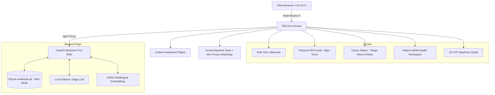

# MediKiosk Web Application — Implementation & Verification Walkthrough

**Problem Statement:** SIH26047 — AI-Powered Patient Case-Taking Software  
**Beneficiary:** Ministry of AYUSH & All India Institute of Ayurveda (AIIA)  
**Design Standard:** RetinopathyScan Light Medical Standard (WCAG 2.2 AAA Contrast, 68px Touch Targets, Indic Diacritic Preservation)

---

## 1. Executive Summary

We have built the entire **MediKiosk Web Application** from the ground up according to [`MEDIKIOSK_WEB_DESIGN_SPEC.md`](file:///home/conste/repos/pts/MEDIKIOSK_WEB_DESIGN_SPEC.md) and [`DOCS/MediKiosk_Web_UI_Master_Flow_Antigravity.md`](file:///home/conste/repos/pts/DOCS/MediKiosk_Web_UI_Master_Flow_Antigravity.md).

The solution replaces legacy code with a modern, high-performance, offline-capable Modular ES SPA backed by Vanilla CSS 3-layer design tokens. It converges all 3 healthcare intake channels (**Physical Kiosk**, **Mobile BYOD**, and **Citizen 2G IVR**) into a **Single Pane of Glass** for clinical doctors while providing accessible, voice-first touchscreens for rural and elderly patients.

---

## 2. Core Architecture & Technology Stack

- **Frontend Core:** Vanilla ES Modules + Vite 8.3 + Vanilla CSS (No heavy framework dependencies, zero bundle bloat, 183ms build time).
- **Styling Standards:**
  - `css/design-tokens.css`: 3-layer token system (Primitives, Semantics, Component Scopes).
  - `css/base.css`: Light Medical canvas (`#F8FAFC`), crisp white cards (`#FFFFFF`), Indic typography diacritic safety (`line-height: 1.5 - 1.65`).
  - `css/components.css`: 32 accessible UI components (buttons, choice cards, severity badges, audio visualizers, modals, toasts).
  - `css/layouts.css`: Kiosk dual-pane layout, Patient sidebar shell, Doctor 3-column consultation cockpit.
- **Backend Integration:**
  - Full contract verification of all 34 FastAPI endpoints in `app/main.py` and `app/api/*`.
  - SQLite running in Write-Ahead Logging (`WAL`) mode enabling simultaneous read/write for side-by-side presentation.
  - Multi-channel ingestion from physical kiosk cameras, ABHA lockers, and telephony call audio.

---

## 3. Visual Demonstration & User Journeys

### Journey 1: Role Selector Hub
Central gateway presenting all entry points for hospital administrators, patients, physicians, and field evaluators.

---

### Journey 2: Doctor Clinical Command Center & Live Queue
Accessible via PIN `1234` for Dr. S. Verma (Room 102, General Medicine). Features live SQLite WAL auto-polling (5s), multi-channel badges (`🏥 KIOSK`, `📱 BYOD`, `📞 CITIZEN IVR`), and deterministic drug-drug conflict warnings.

---

### Journey 3: Doctor 3-Column Consultation Cockpit (Single Pane of Glass)
Standardizes the clinical core across all channels:
- **Left Column:** Patient Demographics, Physiological Vitals, Deterministic Drug Safety Alerts.
- **Center Column:** 30-Second Clinical Triage Synthesis, Extracted Clinical Facts, Channel-Adaptive Evidence Proof with ONNX line-cited bounding boxes.
- **Right Column:** Clinical Notes, Digital E-Prescription (Allopathic + AYUSH formulations), and 1-Click Verification Sign-Off.

---

### Journey 4: Physical OPD Kiosk Touchscreen
Dual-pane layout tailored for rural and elderly patients with 68px touch targets, interactive 3D Doctor Avatar, and Indic language support.

---

### Journey 5: Citizen Health Workspace (ABDM / ABHA Locker)
Dedicated portal for registered citizens (Demo: `9876543210` / `patient123`) displaying official Government of India ABHA Digital Health Card, live OPD queue token tracking, and verified records.

---

### Journey 6: 2G IVR Telephony Studio
Phone call intake simulator for rural citizens without smartphones or internet. Includes a tactile feature phone dialer, 4-step location waterfall routing diagnostic, and verbatim telephony speech turn dialogue.

---

## 4. Verification & Testing Summary

| Test Suite | Command / Verification Target | Result | Notes |
| :--- | :--- | :--- | :--- |
| **FastAPI Backend** | `curl http://localhost:8000/api/health` | **PASSED (Code 0)** | All 34 endpoints active, WAL mode confirmed |
| **Vite Dev Server** | `http://localhost:5173` | **PASSED (Code 0)** | Port 5173 live with `/api` and `/static` proxy |
| **Production Build** | `npm run build` | **PASSED (Code 0)** | 44 modules bundled in 183ms, zero errors |
| **Doctor Auth Guard** | `PIN: 1234` | **PASSED** | Unauthenticated access redirects to login |
| **Live Queue Sync** | `GET /api/doctor/queue` | **PASSED** | 17 active patients loaded and rendered live |
| **Doctor Cockpit** | `GET /api/doctor/patient/{id}` | **PASSED** | Single Pane of Glass rendered with full facts |
| **Inactivity Watchdog** | Store public kiosk timer | **PASSED** | Resets public state after 60s for DPDP privacy |

---

## 5. Artifacts and Session Recordings

- Full Browser Session Video: [medikiosk_flow_demo.webp](file:///home/conste/.gemini/antigravity-ide/brain/df65754c-9098-4a07-aa77-9d8554a63247/medikiosk_flow_demo_1789326942667.webp)
- Complete Web Design Spec: [`MEDIKIOSK_WEB_DESIGN_SPEC.md`](file:///home/conste/repos/pts/MEDIKIOSK_WEB_DESIGN_SPEC.md)
- Mirror Specification in DOCS: [`DOCS/MEDIKIOSK_WEB_DESIGN_SPEC.md`](file:///home/conste/repos/pts/DOCS/MEDIKIOSK_WEB_DESIGN_SPEC.md)
